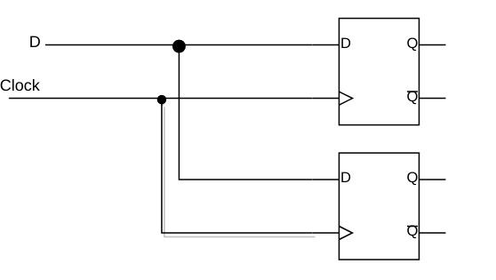
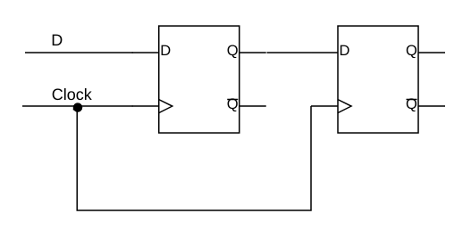
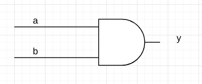

# 给 Verilog 写一个总结（一）


> 前言：我大致完成了一个学期的「数字逻辑实验」，是时候给我的 verilog 写一个总结了，好不容易学会的 verilog 不能说忘就忘，后续会创建一个仓库，把自己经常使用的代码收集起来


首先特别想吐槽 verilog 的 begin end，`真的非常非常蠢`。。。尤其是 case 里面的：


```verilog
case (variable)
    
endcase
```


由于自己实现过一个简单的「解释器」，像这样语法方面的东西，真的说改就能改，作为一个 1992 左右年出来的语言， `就不能在语法方面向 C 语言靠拢吗`？


## 0X00 运行代码


verilog 不是非要和 vivado 等类似的工具在一起才能运行的，是有工具能够编译和执行的：


详细看我的这篇文章：


[Verilog 入门（一）Hello World](https://www.jianshu.com/p/c3cf4db63fa7)


## 0X01 变量基础

变量方面的知识绝对是一大难点，跟其他语言完全不一样！


### 数据类型以及变量的声明

+ **NETS**


wire 是 NETS 的一种，通常我们使用 wire 声明 NETS 变量


```verilog
wire a;
```


+ **Registers**


reg 是 Registers 的一种，通常我们使用 reg 声明 Registers 变量

```verilog
reg b;
```


### module 输入/输出类型的声明


我们可以这样声明 input / output 类型：


```verilog
module test(
    input a,
    output b
);
reg b;
...
endmodule
```


也可以这样声明 input / output 类型：


```verilog
module test(
    input a,
    output reg b
);

...
endmodule
```


其中未声明的 input / output 默认是 wire 类型，`这两种类型具体有啥区别，你在后面的内容中会慢慢感受到`。  


`为了方便，我将 NETS 类型和 Registers 类型分别用 wire 和 reg 代替`


### 变量的赋值


在这里我们将遇到 wire 和 reg 的第一个不同点


+ 给 wire 赋值


你可以这样写：


```verilog
wire a = 10;
```


也可以这样写：


```verilog
wire a;
assign a = 10;
```


这两者赋值的方式等价！


+ 给 reg 赋值


给 reg 赋值不能用 assign，而且要在块里面赋值。


你可以这样赋值：


```verilog
module test();
    reg t;
    always @(*) begin
        t = 10;
    end
endmodule
```


也可以这样赋值：


```verilog
module test();
    reg t;
    always @(*) begin
        t <= 10;
    end
endmodule
```


`这两种方式不等价，待会会具体抽出来比较这两者的区别`


## 0X02 = VS <=


我们来看下面这两段代码：


```verilog
// A.v
module A(
    input D, Clock;
    output reg Q1, Q2;
);
    always @(posedge Clock) begin
        Q1 = D;
        Q2 = Q1;
    end
endmodule
```


```verilog
// B.v
module B(
    input D, Clock;
    output reg Q1, Q2;
);
    always @(posedge Clock) begin
        Q1 <= D;
        Q2 <= Q1;
    end
endmodule
```


下面分别是他们综合以后的图：






第一幅图是 A 的，第二幅图是 B 的。为什么会这样呢？


`= 是阻塞赋值，<= 是非阻塞赋值`。A 的代码会被认为：


```verilog
Q1 = D;
Q2 = D;
```


所以会出现两个并行 D 触发器的样子


而 <= 赋值是等这个块结束以后再赋值，Q2 拿的不是 Q1 的新值，拿的是 Q1 的旧值。


## 0X03 变量的初始化


在其他语言中我们经常干的就是「变量初始化」：


```java
String text = "你真的是我见过的最好看的女生"
```


在 verilog 中「变量的初始化」很不同！


首先对于 input 与 output 的初始化：


```verilog
module A(
    input D, Clock;
    output reg Q1, Q2;
);
...
endmodule
```


+ input 不用初始化


input 是不能被初始化的，因为 input 是上一个 module 给的的，你初始化他干啥！


+ output 初始化的时候一定是 reg 类型


之前我们说过 reg 类型只能在**块中被赋值**


所以 reg 类型的初始化在


```verilog
initial begin 
end
```


中。


写一段代码就是这样：


```verilog
module A(
    input D, Clock;
    output reg Q1, Q2;
);
    initial begin 
    	Q1 <= 0;
        Q2 <= 0;
    end
endmodule
```


最后说说对 wire 的赋值：


通常在块外使用 `assign` 给 wire 赋值，最简单的理解 `assign` 的方法就是想象「一条线」


```verilog
assign y = 1;
```


相当于给 y 拉一条恒等于 1 的线。


## 0X04 Wire VS Reg


我们来到我这篇博客的最后一部分「Wire VS Reg」


+ **wire 的 assign 的赋值都可以转换成 reg 在块中赋值**

首先来看两段代码：


wire 的 assign 的赋值

```verilog
// A.v
module A( a, b, y);
    input a, b;
    output y;
    wire a, b, y;
    assign y = a & b;
endmodule
```


这段代码综合以后的电路：





而 reg 在块中赋值


```verilog
// B.v
module B( a, b, y);
        input a, b;
        output y;

        reg   y;
        wire a, b;

        always @ ( a or b)
        begin	
        	 y = a & b;
        end
endmodule
```


综合以后的电路：


这两者的电路真的一模一样！！！


所以 **wire 的 assign 的赋值都可以转换成 reg 在块中赋值**


未完待续...

